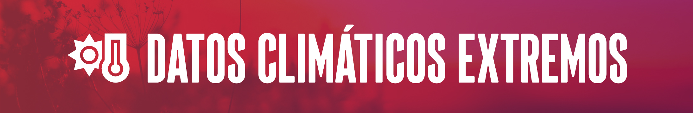
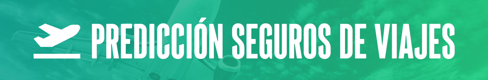
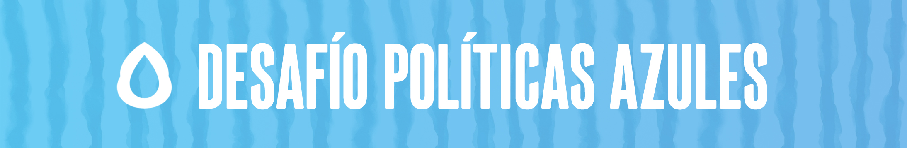
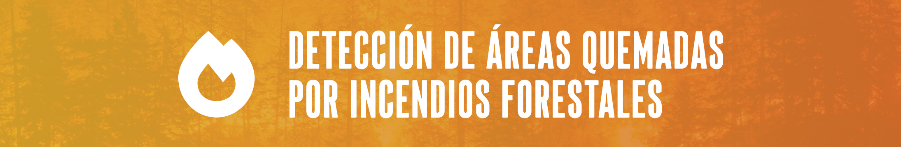

#  Hola, soy Diego

## 🧔🏻‍♂️ Sobre mí

- 🌍 Geógrafo / Cartógrafo
- 🔍 Analista de seguros
- 👀 Observador
- 📝 Siempre aprendiendo
- 💪🏼 Listo para nuevos retos

## 🔧 Tecnologías y herramientas

## 💼 Mis proyectos

 

Este proyecto consiste en un entregable desarrollado para el bootcamp de Data Science de The Bridge para mostrar las habilidades adquiridas de programación en Python. El código consiste en el juego "Hundir la Flota", donde un jugador/a se bate en duelo con la consola. Los barcos de ambos jugadores de colocarán de forma aleatoria en un tablero de 10x10 posiciones y, por turnos, dispararán a las posiciones con el objetivo de hundir la flota completa del enemigo. Puedes comprobar el [repositorio](https://github.com/dmtor/Hundir-la-Flota).

---
 

Proyecto de Análisis Exploratorio de Datos (EDA), el cual se desarrolló como parte de mi formación en la escuela The Bridge. Se enfoca en el estudio de eventos climáticos extremos en España. Mediante el análisis de variables como temperatura, precipitación y viento, se busca identificar patrones, tendencias y la frecuencia de estos eventos. El objetivo es comprender mejor el comportamiento climático y sus implicaciones con el estudio de 820 estaciones clímaticas en el periodo 2014-2022. Puedes comprobar el [repositorio](https://github.com/dmtor/Datos_climaticos_extremos).

---
 

Este proyecto, realizado como estudiante en The Bridge, se enfoca en el análisis y predicción de contratación de seguros de viaje utilizando diversos modelos predictivos de aprendizaje automático. El objetivo principal es aplicar y evaluar diferentes algoritmos para predecir si un cliente contratará o no un seguro de viaje. Durante el proyecto, se han utilizado técnicas de preprocesamiento de datos y se ha realizado un análisis exhaustivo. El objetivo es adquirir experiencia práctica en el campo del aprendizaje automático y fortalecer las habilidades en la implementación y evaluación de modelos predictivos. Puedes comprobar el [repositorio](https://github.com/dmtor/ML_Travel).

---

El proyecto final del bootcamp se centra en el "Desafío de Tripulaciones", donde los estudiantes de diferentes verticales de la escuela (Data Science, Full Stack, UX/UI y Ciberseguridad) se unen en varios grupos para desarrollar una aplicación funcional. El tema principal es El Agua y la subtemática de nuestro grupo fueron las Políticas Azules. A lo largo del proyecto, trabajaremos juntos para crear una aplicación educativa que aborde esta temática para tratar de concienciar a la población sobre la problematica de la escasez, calidad y uso del agua. Puedes comprobar la [app final](https://flourishing-sable-f526bd.netlify.app/).

**Nota:** El equipo de data desarrollamos un modelo predictivo para determinar como evolucionará el nivel de los embalses en el futuro, pero no está diponible debido a que el modelo se subió a AWS y lo hemos deshabilitado para evitar posibles gastos.

---
## 🚧 En proceso

Actualmente, estoy trabajando en un proyecto que utiliza redes neuronales U-Net para identificar zonas afectadas por incendios forestales, mediante mi propio conjunto de imágenes multiespectrales obtenidas a través del satélite Sentinel II, gracias al programa Copernicus.

